---

I design enterprise data platforms and the GenAI systems that run on top of them. Over 10+ years across telecom, IoT, agritech, retail and e-commerce, my work has centred on one problem: turning fragmented operational data into governed, reliable foundations that analytics and AI can be trusted on.

Currently at **Thoughtworks**, architecting data platforms for global retail and e-commerce clients. Based in Hyderabad / Bengaluru. Open to remote engagements and advisory work.

### Areas of Practice

| Domain | Scope |
|---|---|
| **Data Platform Architecture** | Lakehouse and warehouse design, batch + streaming ingestion, Data Vault modeling, cross-warehouse interoperability |
| **Production GenAI** | RAG architectures, agentic AI on governed data, retrieval and vector store design, LLM fine-tuning (LoRA / QLoRA) |
| **Data Quality & Governance** | Validation frameworks, contract-driven pipelines, observability across heterogeneous sources |
| **Cloud-Native Delivery** | Platform design on AWS, Azure and GCP; infrastructure as code; containerised workloads |

### Selected Engagements

| Period | Client | Engagement | Architecture |
|---|---|---|---|
| 2025 | Otto GmbH | Assortment Analytics Platform | Data Vault on BigQuery, cross-warehouse transfer to Snowflake, agentic AI over assortment data |
| 2024–25 | JCPenney | Enterprise Data Platform Modernization | Great Expectations–based quality framework spanning Spark, Kafka and Oracle workloads |
| 2019–21 | Ooredoo Qatar | Notification Gateway & DWH | Pub-sub architecture on Kafka Streams over a managed Cloudera cluster |
| 2016–19 | — | Digimate | SMS operator platform serving 1,500+ B2B and B2C customers |

### Technology

| | |
|---|---|
| **Languages** |     |
| **Data Processing** |     |
| **Platforms** |     |
| **GenAI & ML** |     |
| **Cloud & Infra** | ![AWS](https://img.shields.io/badge/AWS-0d1117?style=flat-square&logo=data:image/svg%2bxml;base64,PHN2ZyBmaWxsPSIjMDBGNUQ0IiB2aWV3Qm94PSIwIDAgMTI4IDEyOCIgeG1sbnM9Imh0dHA6Ly93d3cudzMub3JnLzIwMDAvc3ZnIj4KICA8cGF0aCBmaWxsPSIjMDBGNUQ0IiBkPSJNMTA4LjU5IDI2LjE0OGMtMS44NTIgMC0zLjYyMi4yMTEtNS4zMDUuNzE1LTEuNjg0LjUwNC0zLjExNyAxLjIyMy00LjM3OSAyLjE4OGExMC44MjkgMTAuODI5IDAgMCAwLTMuMDMxIDMuNDUzYy0uNzU3IDEuMzQ4LTEuMTM3IDIuOTA2LTEuMTM3IDQuNjc2IDAgMi4xODcuNzE2IDQuMjUgMi4xMDYgNi4xMDUgMS4zODYgMS44OTUgMy42NiAzLjMyNCA2LjczNCA0LjI5M2w2LjEwNiAxLjg5NWMyLjA2Mi42NzUgMy40OTYgMS4zOTEgNC4yNTQgMi4xOTEuNzU3LjgwMSAxLjEzNiAxLjc2NSAxLjEzNiAyLjk0NSAwIDEuNzI2LS43NTggMy4wNzQtMi4xOTEgNC0xLjQzLjkyNS0zLjQ5MiAxLjM5MS02LjE0NSAxLjM5MS0xLjY4NyAwLTMuMzI4LS4xNjgtNS4wMTEtLjUwNGEyMy4xMDIgMjMuMTAyIDAgMCAxLTQuNjMzLTEuNDc2Yy0uNDIxLS4xNjgtLjgwMS0uMzM2LTEuMDUxLS40MThhMi4zNTcgMi4zNTcgMCAwIDAtLjc1OC0uMTNjLS42MzQgMC0uOTY5LjQyMy0uOTY5IDEuMzA1djIuMTQ5YTIuOTE5IDIuOTE5IDAgMCAwIC4yNTQgMS4xOGMuMTY4LjM4LjYyOS44IDEuMzA1IDEuMTggMS4wOTQuNjI4IDIuNzM0IDEuMTc5IDQuODQgMS42ODMgMi4xMDUuNTA0IDQuMjk3Ljc1OCA2LjQ4NC43NTggMi4xNSAwIDQuMTI5LS4yOTcgNi4wMjQtLjg4MyAxLjgwOC0uNTUxIDMuMzY3LTEuMzA5IDQuNjcyLTIuMzYgMS4zMDQtMS4wMSAyLjMxNi0yLjI3MyAzLjA3NC0zLjcwNy43MTQtMS40MjkgMS4wOTQtMy4wNyAxLjA5NC00Ljg4MiAwLTIuMTg4LS42MzMtNC4xNjgtMS45MzgtNS44OTUtMS4zMDQtMS43MjctMy40OTEtMy4wNzQtNi41MjMtNC4wNDNsLTUuOTgtMS44OTVjLTIuMjMtLjcxMy0zLjc5LTEuNTE2LTQuNjM0LTIuMzE2LS44NC0uNzk3LTEuMjYxLTEuODA4LTEuMjYxLTIuOTg4IDAtMS43MjYuNjcxLTIuOTUgMS45OC0zLjc0NiAxLjMwNS0uODAxIDMuMTk5LTEuMTggNS41OTgtMS4xOCAyLjk4OCAwIDUuNjgzLjU0NyA4LjA4NiAxLjY0LjcxNC4zMzcgMS4yNjEuNTA4IDEuNTk3LjUwOC42MzMgMCAuOTY5LS40NjMuOTY5LTEuMzQ3di0xLjk4YzAtLjU5LS4xMjUtMS4wNTEtLjM3OS0xLjM5MS0uMjUtLjM3OC0uNjcyLS43MTUtMS4yNjItMS4wNTEtLjQyMi0uMjU0LTEuMDExLS41MDQtMS43Ny0uNzU4YTMyLjUyOCAzMi41MjggMCAwIDAtMi4zOTgtLjY3NmMtLjg4Ni0uMTY4LTEuNzY5LS4zMzYtMi43MzgtLjQ2YTIxLjM0NyAyMS4zNDcgMCAwIDAtMi44Mi0uMTY5em0tODYuODIyLjA4MmMtMi4zMTYgMC00LjUwOC4yNTQtNi41Ny44MDEtMi4wNjMuNTA1LTMuODMxIDEuMTM3LTUuMzAzIDEuODk1LS41OS4yOTctLjk3LjU5LTEuMTguODgzLS4yMTEuMjk2LS4yOTMuOC0uMjkzIDEuNDc2djIuMDYzYzAgLjg4Mi4yOTMgMS4zMDQuODgzIDEuMzA0LjE2OCAwIC4zNzgtLjA0My42NzQtLjEyNS4yOTMtLjA4Ni43OTYtLjI1NCAxLjQ3Mi0uNTQ3YTMzLjQxNiAzMy40MTYgMCAwIDEgNC41NDctMS40MzNBMTkuMTc2IDE5LjE3NiAwIDAgMSAyMC41NDcgMzJjMy4yNDIgMCA1LjUxMy42MzMgNi44NjMgMS45MzggMS4zMDQgMS4zMDMgMS45OCAzLjUzNCAxLjk4IDYuNzM0djMuMDc0Yy0xLjY4My0uMzc5LTMuMjgzLS43MTUtNC44NDMtLjkyNi0xLjU1OC0uMjEtMy4wMzEtLjMzNi00LjQ2MS0uMzM2LTQuMzQgMC03Ljc1IDEuMDk0LTEwLjMxNiAzLjI4Ni0yLjU3MSAyLjE4Ny0zLjgzMiA1LjA5My0zLjgzMiA4LjY3MSAwIDMuMzY4IDEuMDUgNi4wNjMgMy4xMTMgOC4wODYgMi4wNjYgMi4wMiA0Ljg4NyAzLjAzMiA4LjQyMiAzLjAzMiA0Ljk3IDAgOS4wOTctMS45MzggMTIuMzc5LTUuODEzYTM0LjE1MyAzNC4xNTMgMCAwIDAgMS4zMDQgMi40ODQgMTMuMjggMTMuMjggMCAwIDAgMS41MTYgMS45OGMuNDIyLjM4Ljg0NC41OSAxLjI2Ni41OS4zMzQgMCAuNzE0LS4xMjggMS4wOTMtLjM3OGwyLjY1My0xLjc3Yy41NDYtLjQyLjgtLjg0My44LTEuMjYxYTEuODYgMS44NiAwIDAgMC0uMjkzLS45NyAyMi40NjkgMjIuNDY5IDAgMCAxLTEuMzQ3LTMuMDNjLS4yOTctLjkyNS0uNDY1LTIuMTktLjQ2NS0zLjc1aC0uMDg2VjQwYzAtNC42MzMtMS4xNzYtOC4wODYtMy40OTItMTAuMzYtMi4zNi0yLjI3My02LjAyNS0zLjQxLTExLjAzMy0zLjQxem0xOS41OCAxLjAxMmMtLjY3NiAwLTEuMDEyLjM3OS0xLjAxMiAxLjA1MSAwIC4yOTcuMTI5Ljg0NC4zNzkgMS42ODdsOS44OTQgMzIuNTQ3Yy4yNTQuOC41NDcgMS4zODcuODg3IDEuNjQxLjMzNi4yOTcuODQuNDIyIDEuNTk4LjQyMmgzLjYyYy43NTkgMCAxLjM0Ny0uMTI1IDEuNjg0LS40MjIuMzQtLjI5My41OTEtLjg0LjgwMS0xLjY4NGw2LjQ4NS0yNy4xMTcgNi41MjcgMjcuMTZjLjE2OC44NC40NiAxLjM4Ny44IDEuNjg0LjMzNy4yOTIuODgzLjQyMiAxLjY4NC40MjJoMy42MjFjLjcxNSAwIDEuMjYyLS4xNjcgMS41OTgtLjQyMi4zNC0uMjUzLjYzMy0uOC44ODctMS42NEw5MC45NDkgMzAuMDJjLjE2OC0uNDYuMjUtLjc5Ny4yOTMtMS4wNTEuMDQzLS4yNTQuMDg2LS40NjYuMDg2LS42NzYgMC0uNzE1LS4zNzktMS4wNS0xLjA1NS0xLjA1SDg2LjM2Yy0uNzU3IDAtMS4zMDguMTY2LTEuNjQ0LjQyMS0uMjkzLjI1LS41OS44LS44NCAxLjY0TDc2LjU5IDU3LjUxN2wtNi42NTMtMjguMjExYy0uMTY2LS44LS40NjQtMS4zOS0uOC0xLjY0LS4zMzYtLjI5OC0uODg0LS40MjMtMS42ODQtLjQyM2gtMy4zNjdjLS43NTggMC0xLjM0OC4xNjctMS42ODguNDIyLS4zMzUuMjUtLjU4OC44LS43OTYgMS42NGwtNi41NyAyNy44NzYtNy4wNzUtMjcuODc1Yy0uMjUtLjgtLjUwNC0xLjM5LS44NC0xLjY0LS4yOTctLjI5OC0uODQ0LS40MjMtMS42NDQtLjQyM2gtNC4xMjV6TTIxLjY0IDQ3LjQ5NmEzMS44MTYgMzEuODE2IDAgMCAxIDMuOTYuMjUgMzQuNDAxIDM0LjQwMSAwIDAgMSAzLjg3Mi43MTl2MS43NjVjMCAxLjQzNS0uMTY4IDIuNjUzLS40MjIgMy42NjUtLjI1IDEuMDEtLjc1OCAxLjg5NS0xLjQzIDIuNjk1LTEuMTM3IDEuMjYyLTIuNDg0IDIuMTg3LTQgMi42OTUtMS41MTYuNTA0LTIuOTQ5Ljc1OC00LjMzNi43NTgtMS45MzcgMC0zLjQxLS41MDgtNC40MjItMS41NTktMS4wNTQtMS4wMS0xLjU1OC0yLjQ4NC0xLjU1OC00LjQ2NCAwLTIuMTA2LjY3NS0zLjcwNCAyLjA2Mi00Ljg0IDEuMzkxLTEuMTM3IDMuNDU0LTEuNjg0IDYuMjc0LTEuNjg0ek0xMTggNzMuMzQ4Yy00LjQzMi4wNjMtOS42NjQgMS4wNTItMTMuNjIxIDMuODMyLTEuMjIzLjg4My0xLjAxMiAyLjA2Mi4zMzYgMS44OTQgNC41MDgtLjU0NyAxNC40NC0xLjcyNiAxNi4yMS41NDcgMS43NyAyLjIzLTEuOTc2IDExLjYyLTMuNjYzIDE1Ljc5LS41MDQgMS4yNi41OSAxLjc2OSAxLjcyNi44IDcuNDEtNi4yMzEgOS4zNDgtMTkuMjQyIDcuODMyLTIxLjEzNy0uNzU3LS45MjUtNC4zODgtMS43OS04LjgyLTEuNzI2ek0xLjYzIDc1Ljg1OWMtLjkyNi4xMTYtMS4zNDcgMS4yMzYtLjM2OCAyLjEyMSAxNi41MDggMTQuOTAyIDM4LjM1OSAyMy44NzIgNjIuNjEzIDIzLjg3MiAxNy4zMDUgMCAzNy40My01LjQzIDUxLjI4MS0xNS42NiAyLjI3My0xLjY4OS4yOTgtNC4yNTQtMi4wMi0zLjIwNC0xNS41MzMgNi41Ny0zMi40MjEgOS43Ny00Ny43ODggOS43Ny0yMi43NzggMC00NC44LTYuMjczLTYyLjY1My0xNi42MzMtLjM5LS4yMzEtLjc1NS0uMzA0LTEuMDY0LS4yNjZ6Ii8+Cjwvc3ZnPgo=) ![Azure](https://img.shields.io/badge/Azure-0d1117?style=flat-square&logo=data:image/svg%2bxml;base64,PHN2ZyBmaWxsPSIjMDBGNUQ0IiB2aWV3Qm94PSIwIDAgMTI4IDEyOCIgeG1sbnM9Imh0dHA6Ly93d3cudzMub3JnLzIwMDAvc3ZnIj48cGF0aCBkPSJNNDMuOTgzIDQuNjUzYTUuOTExIDUuOTExIDAgMDE1LjYgNC4wMjJsMzUuOTEgMTA2LjM5NmE1LjkxMSA1LjkxMSAwIDAxLTUuNjAzIDcuODAyaDQxLjM4YTUuOTE3IDUuOTE3IDAgMDA0LjgtMi40NjUgNS45MDkgNS45MDkgMCAwMC43OTgtNS4zNEw5MC45NjEgOC42NzJhNS45MSA1LjkxIDAgMDAtNS42MDItNC4wMjJ6bS0xLjMzNi40NzhhNS45MiA1LjkyIDAgMDAtNS42MSA0LjAyOUwxLjEzMiAxMTUuNTVhNS45MSA1LjkxIDAgMDA1LjYgNy44aDI4Ljg5M2MxLjIzOSAwIDIuNDQ2LS40MSAzLjQ1Mi0xLjExM2E1LjkyMyA1LjkyMyAwIDAwMi4xNTctMi45MTZsNy4wMTktMjAuNzEtMTMuNDExLTEyLjg1N2MtLjI0Ni0uMjczLTEuMzUzLTIuMjc0LS4zNjktNC4wMDIgMS4xMDgtMS42NTkgMi45NTUtMS42NTkgMi45NTUtMS42NTloMTcuMjg1bDkuMDc0LTI2LjE0NUw0OC4yNzQgOC4zMjFjLS4wNDItLjIwNS0uOTE0LTEuMzY1LTIuMjgxLTIuMjgtMS4zNy0uOTE1LTMuMzQ1LS45MDktMy4zNDUtLjkwOXptLTQuODggNzUuNzRhMi43MjQgMi43MjQgMCAwMC0xLjg2IDQuNzE4bDM3LjgzIDM1LjMxYzEuMTAxIDEuMDMgMi41MDIgMS42MzEgNC4wMDcgMS42MzEgMCAwIDEuMjgyLjA2OCAyLjA1NS0uMDMzIDEuODE3LS4yNzMgMy41MjUtMS43NjggNC4wOS0yLjM5IDEuNDU3LTEuOTM5Ljc5NC00Ljk1Ljc5NC00Ljk1bC0xMS40NS0zNC4yOHoiIGZpbGw9IiMwMEY1RDQiLz48L3N2Zz4K)     |
| **Databases** |    ![Oracle](https://img.shields.io/badge/Oracle-0d1117?style=flat-square&logo=data:image/svg%2bxml;base64,PHN2ZyBmaWxsPSIjMDBGNUQ0IiB4bWxucz0iaHR0cDovL3d3dy53My5vcmcvMjAwMC9zdmciIHZpZXdCb3g9IjAgMCAxMjggMTI4Ij48cGF0aCBmaWxsPSIjMDBGNUQ0IiBkPSJNNTUuMzg3IDY2LjQ2OWg4LjMzM2wtNC40MDctNy4wOS04LjA4OCAxMi44MTloLTMuNjgxTDU3LjM4MiA1Ni44YTIuMzI0IDIuMzI0IDAgMDExLjkzMS0uOTk4Yy43NjUgMCAxLjQ3OC4zNjMgMS44OTIuOTcybDkuODc2IDE1LjQyNEg2Ny40bC0xLjczNi0yLjg2NWgtOC40MzhsLTEuODM5LTIuODY0em0zOC4yMzUgMi44NjRWNTUuOTU4aC0zLjEyM3YxNC42ODVjMCAuNDAyLjE1Ni43OTEuNDU0IDEuMDg5LjI5OC4yOTguNy40NjYgMS4xNDEuNDY2aDE0LjI0NGwxLjg0MS0yLjg2NUg5My42MjJ6bS01MS42NzctMi4zOTdjMy4wMzMgMCA1LjQ5Ni0yLjQ0OSA1LjQ5Ni01LjQ4MnMtMi40NjItNS40OTYtNS40OTYtNS40OTZIMjguMjh2MTYuMjQxaDMuMTIzVjU4LjgyMmgxMC4zMzVjMS40NTIgMCAyLjYxOCAxLjE4IDIuNjE4IDIuNjMxcy0xLjE2NyAyLjYzMS0yLjYxOCAyLjYzMWwtOC44MDYtLjAxMyA5LjMyNCA4LjEyN2g0LjUzOGwtNi4yNzQtNS4yNjNoMS40MjV6TTkuMDU5IDcyLjE5OGMtNC40ODMgMC04LjEyMi0zLjYyOS04LjEyMi04LjExNHMzLjYzOC04LjEyNyA4LjEyMi04LjEyN2g5LjQzOWM0LjQ4NSAwIDguMTIxIDMuNjQzIDguMTIxIDguMTI3cy0zLjYzNiA4LjExNC04LjEyMSA4LjExNEg5LjA1OXptOS4yMjktMi44NjVhNS4yNSA1LjI1IDAgMDA1LjI1OC01LjI0OSA1LjI2MiA1LjI2MiAwIDAwLTUuMjU4LTUuMjYzSDkuMjY3YTUuMjYyIDUuMjYyIDAgMDAtNS4yNTYgNS4yNjMgNS4yNSA1LjI1IDAgMDA1LjI1NiA1LjI0OWg5LjAyMXptNTkuMzE0IDIuODY1Yy00LjQ4NCAwLTguMTI2LTMuNjI5LTguMTI2LTguMTE0czMuNjQyLTguMTI3IDguMTI2LTguMTI3aDExLjIxMmwtMS44MjkgMi44NjRINzcuODFhNS4yNjcgNS4yNjcgMCAwMC01LjI2NCA1LjI2M2MwIDIuOTAzIDIuMzYgNS4yNDkgNS4yNjQgNS4yNDloMTEuMjYzbC0xLjg0IDIuODY1aC05LjYzMXptMzguMTk3LTIuODY1YTUuMjUgNS4yNSAwIDAxLTUuMDU1LTMuODI0aDEzLjM1bDEuODQtMi44NjRoLTE1LjE5YTUuMjY2IDUuMjY2IDAgMDE1LjA1NS0zLjgyNGg5LjE2M2wxLjg1NC0yLjg2NGgtMTEuMjI1Yy00LjQ4NCAwLTguMTI2IDMuNjQzLTguMTI2IDguMTI3czMuNjQyIDguMTE0IDguMTI2IDguMTE0aDkuNjMxbDEuODQxLTIuODY1aC0xMS4yNjQiLz48L3N2Zz4=)  |

### Certifications

- Google Cloud — Professional Data Engineer (2025)
- AWS — Solutions Architect Associate (2022)
- Red Hat — Certified Engineer (2016)

### Writing

I write about data platform design and applied GenAI at [blog.harisankarsivankutty.in](https://blog.harisankarsivankutty.in/) and on [Medium](https://medium.com/@brainbytebyhari).

---

